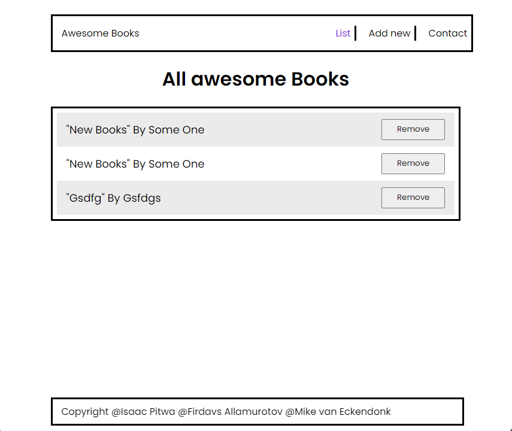

# Awesome Books

> Awesome Books: a basic website that allows users to add/remove books from a list.You will achieve that by using JavaScript objects and arrays. You will also need to dynamically modify the DOM and add basic events.

## Live preview

Awesome Books can be accessed [here](https://isaacpitwa.github.io/awesome-books/)

## Built With

- HTML & CSS Sass
- Javascript
- GitFlow
- Linters
- Documented Work

## Development set up

Clone Repository using
`git clone git@github.com:isaacpitwa/awesome-books.git`

OR using HTTPS

`https://github.com/isaacpitwa/awesome-books.git`

move into project directory
`cd awesome-books`

## Authors

👤 **Author **

- GitHub: [@mrEckendonk](https://github.com/mrEckendonk)
- Twitter: [@mrEckendonk](https://twitter.com/mrEckendonk)
- LinkedIn: [LinkedIn](https://www.linkedin.com/in/mike-van-eckendonk/)

## Attribution

## 🤝 Contributing

Contributions, issues, and feature requests are welcome!

Feel free to check the [issues page](../../issues/).

## Show your support

Give a ⭐️ if you like this project!

## 📝 License

This project is [Creative Commons](https://creativecommons.org/licenses/by-nc/4.0/legalcode) licensed.
